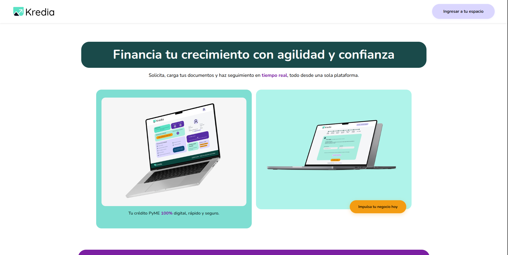

# Simulación Laboral — Proyecto Grupo 03

## Kredia

Kredia es una plataforma web que permite a las PyMEs solicitar créditos
empresariales de forma 100% digital, segura y rápida.
El sistema fue diseñado para optimizar el flujo entre la empresa solicitante (PyME)
y el operador asesor encargado de evaluar la solicitud.

Resumen técnico
-------------
Aplicación web desarrollada como entrega de la Simulación Laboral (NoCountry). Incluye frontend (Vite + React) y backend (Node.js/Express) para registro, autenticación, gestión de usuarios y carga/gestión de documentos.

Tecnologías principales
----------------------
- Frontend: React, Vite, CSS modular, Bootstrap
- Backend: Node.js, Express, Jest
- Almacenamiento: Firebase / Supabase (servicios según configuración)
- Contenedores: Docker / docker-compose (opcional)

Estructura del proyecto
-----------------------
- /frontend — aplicación cliente (Vite + React)
- /backend — API REST (Express)
  - src/controllers, models, repositories, services, middlewares, routes
  - tests/unit — pruebas unitarias con Jest
- /uploads — archivos subidos (desarrollo)

Instalación rápida
--------------------------
1. Clonar:
   - git clone <repo>
   - cd SimulacionLaboral

2. Backend:
   - cd backend
   - cp .env.example .env  # ajustar variables
   - npm install
   - docker compose run -p 3001:3001 --rm app npm run dev          # ejecutar entorno de desarrollo
   - docker compose up -d --build          # ejecutar entorno de producción
   - npm test              # ejecutar tests

3. Frontend:
   - cd ../frontend
   - cp .env .env.local    # ajustar si es necesario
   - npm install
   - npm run dev

Puntos importantes
------------------
- Revisar .env y .env.example en backend para claves (JWT, DB, storage).
- Los controladores utilizan repositorios (pattern repository) y middleware de validación.
- Tests unitarios en backend están configurados con Jest; ver jest.config.js y jest.setup.js.

Contribuir
----------
- Crear ramas por feature: feature/nombre
- Abrir PR con descripción clara y pruebas si aplica

Contacto
--------
Grupo 03 — Simulación Laboral [NoCountry](https://nocountry.tech/)

#### Project Manager
- [Gonzalo Solaligue](https://www.linkedin.com/in/joaquingonzalosolaligue)

#### Graphic Designer
- [Valentina Sanchez](https://www.linkedin.com/in/valentina-sanchezuxui?utm_source=share&utm_campaign=share_via&utm_content=profile&utm_medium=android_app)

#### Front-end Developer
- [Miguel Solis](https://www.linkedin.com/in/miguel-solis-cunza)

#### Back-end Developers
- [Pablo Vergara](https://www.linkedin.com/in/pablo-vergara-ab9489228/)
- [Julieta Chaki](https://www.linkedin.com/in/julieta-chaki)

